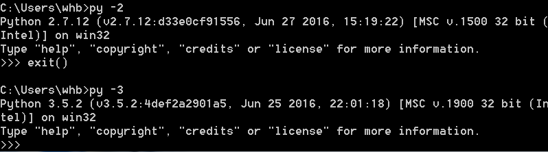

# python 环境搭建
## 在mac上安装python（mac自带2.7）
1. 方法一： 使用 `homebrew` 安装， `brew install python3`。
1. 方法二： 官网下载安装程序，双击安装。

## 在windows上安装python
1. 官网下载安装程序，双击安装。（勾选 `Add Python 3.x to PATH` 将 `python` 添加至环境变量）

## 在linux上安装python
1. 下载源码压缩包后解压编译安装。
	```
	tar -zxvf Python-3.x.y.tgz
	cd Python-3.x.y
	./configure
	make && make install
	```

## 检验是否成功安装
1. 终端执行 `python --version`
1. python2和3可以共存与一台主机，使用时需要指明。（pip同样）


## IDE安装 - PyCharm
1. 下载地址: [https://www.jetbrains.com/pycharm/download/](https://www.jetbrains.com/pycharm/download/)

# 参考文档
1. 官网 [https://www.python.org/](https://www.python.org/)
1. 源码压缩包 [https://www.python.org/downloads/source/](https://www.python.org/downloads/source/)
1. 廖雪峰 [安装 python](https://www.liaoxuefeng.com/wiki/897692888725344/897692941155968)
2. 菜鸟教程 [python 环境搭建](https://www.runoob.com/python3/python3-install.html)
