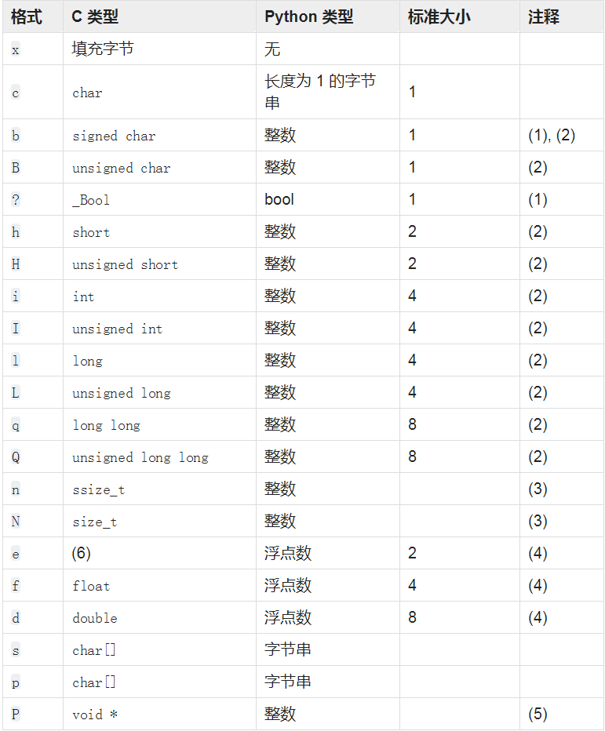

# struct 将字节串解读为打包的二进制数据
该模块用于 **python值** 和 **以python bytes对象表示的C 结构**（struct）之间的转换。使用 [Format Strings](https://docs.python.org/3.5/library/struct.html#struct-format-strings) 作为 C 结构的描述。

## struct 模块的函数
- `pack(format, v1, v2, ...)` 返回 `bytes` 对象，包含根据格式字符串 `format` 打包的值 `v1`, `v2` ...，参数的个数必须与格式字符串匹配
- `pack_into(format, buffer, offset, v1, v2, ...)` 将打包的字节串写入可写缓冲区 `buffer` 从 `offset` 开始的位置
- `unpack(format, buffer)` 根据格式字符串 `format` 从缓冲区 `buffer` 解包（假定是由 `pack(format, ...)` 打包）
	1. 缓冲区的字节大小必须匹配格式所要求的大小
- `unpack_from(format, buffer, offset=0)`
	1. 缓冲区的字节大小必须匹配格式所要求的大小
- `iter_unpack(format, buffer)` 根据格式字符串 `format` 以迭代方式从缓冲区 `buffer` 解包。
	1. 缓冲区的字节大小必须整数倍于格式所要求的大小
- `calcsize(format)` 返回与格式字符串 `format` 相对应的结构体的大小

## 格式字符串
格式字符串：在打包/解包数据时指定数据的“结构”

字节顺序、大小和对齐方式
1. 默认情况下，C 类型以机器的本机格式和字节顺序表示，并在必要时通过跳过填充字节进行正确对齐（根据C编译器使用的规则）。
	1. 本机字节顺序：可能为大端或是小端，取决于主机系统的不同，使用 `sys.byteorder` 来检查系统字节顺序
	1. 本机大小和对齐方式是使用 C 编译器的 `sizeof` 表达式来确定的。 这总是会与本机字节顺序相绑定。

2. 或者，格式字符串的第一个字符指定打包数据的字节顺序、大小和对齐方式
	- 默认为 `'@'`

格式字符


示例：`'>IH'`， `>` 表示大端，`I` 表示4字节无符号整数，`H` 表示2字节无符号整数

## 示例 解析.bmp文件
BMP格式采用小端方式存储数据，文件头的结构按顺序如下：
- 两个字节：`'BM'` 表示 Windows 位图，`'BA'` 表示 OS/2 位图； 
- 4字节整数：表示位图大小； 
- 4字节整数：保留位，始终为 0； 
- 4字节整数：实际图像的偏移量； 
- 4字节整数：`Header` 的字节数； 
- 4字节整数：图像宽度； 
- 4字节整数：图像高度； 
- 2字节整数：始终为 1； 
- 2字节整数：颜色数。

所以，格式字符串为 `<2sIIIIIIHH`：

使用 “画图” 软件创建空白位图文件 example.bmp
```
from collections import namedtuple
from struct import unpack,pack

with open('example.bmp', 'rb') as f:
    s = f.read(30)
    print(s) # b'BM\x0e\xf9\x16\x00\x00\x00\x00\x006\x00\x00\x00(\x00\x00\x00S\x02\x00\x00J\x03\x00\x00\x01\x00\x18\x00'

    BMP = namedtuple('BMP', 'platform long retain1 offset header width height retain2 colors')
    b = BMP._make(unpack('<2sIIIIIIHH', s))
    print(b) # BMP(platform=b'BM', long=1505550, retain1=0, offset=54, header=40, width=595, height=842, retain2=1, colors=24)
```
1. ps. 可以将解包的字段包装为一个命名元组


# 参考文档
1. 官网 [struct](https://docs.python.org/3.5/library/struct.html) | [Format Strings](https://docs.python.org/3.5/library/struct.html#struct-format-strings)