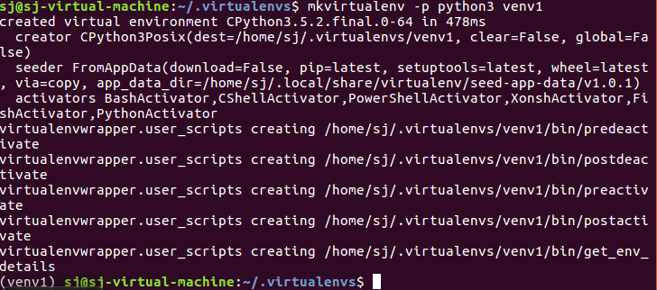

# 虚拟环境
## 使用虚拟环境的原因
实际开发中会遇到不同的项目对某一模块依赖不同版本的问题，会出现如下的现象：后开发的项目安装了某一模块的新版本，机器上该模块的旧版本被覆盖，导致先开发的项目的该模块版本错误，可能导致该项目运行失败。

所以，需要对不同的项目使用不同的 python 环境，虚拟环境即提供这样的能力。

虚拟环境的创建使用以下两个第三方模块：
- `virtualenv`
- `virtualenvwrapper` 虚拟环境扩展包，主要解决单独使用 `virtualenv` 时每次在开启虚拟环境前需在虚拟环境所在目录下 `source <虚拟环境名>/bin/active`，这样需要记住每个虚拟环境所在目录

## 安装虚拟环境

1. `sudo pip install virtualenv virtualenvwrapper`
3. 编辑家目录下 `.bashrc` 
	```
	export WORKON_HOME = $HOME/.virtualenvs
	source /usr/local/bin/virtualenvwrapper.sh
	```

4. `source .bashrc`

## 创建虚拟环境
```
mkvirtualenv -p python3 <虚拟环境名>
``` 



1. 创建成功后，会自动工作在这个虚拟环境上（提示符前出现虚拟环境名，如 `(venv1)`）。
1. **虚拟环境决定了包安装在哪里**，cd 到 .virtualenvs 目录可以看到已创建的虚拟环境，包在对应的虚拟环境中。
2. 使用 `deactivate` 命令退出虚拟环境

## 虚拟环境工作流
2.  查看所有虚拟环境 `workon` 再按两次 `tab` 提示
3.  进入虚拟环境 `workon <虚拟环境名>`
2.  在该环境下安装依赖包 `pip install <包名>[==<版本号>]`
3.  退出虚拟环境 `deactivate`
4.  删除虚拟环境 `rmvirtualenv <虚拟环境名>`
5.  查看已安装的包 `pip list`

## 番外：虚拟环境安装过程中可能遇到的问题
1. `source: command not found`
source 命令是bash shell的内置命令，而ubuntu 默认用的是dash，与bash的最大不同在于，dash遵守POSIX标准，ubuntu在启动的时候会运行很多shell脚本，使用dash可以加快启动速度。解决方案是将shell切换回bash，执行以下命令，并选择No 
```
sudo dpkg-reconfigure dash
```

2. `/usr/bin/python: No module named virtualenvwrapper`
我的原因是 `/usr/bin/python` 指向了默认安装的 python2，而`pip instal 模块`的时候安装到了 python3 的 site-packages 中。解决方案是将 `/usr/bin/python` 指向python3
```
sudo cp /usr/bin/python /usr/bin/python_bak
sudo rm /usr/bin/python
sudo ln -s /usr/bin/python3.5 /usr/bin/python
``` 
	1. 备份对python2的链接 
	2. 删除对python2的链接
	3. 重新指定新的链接给 python3

## venv
Python 标准库内置的虚拟环境管理工具，Python 3.3 加入，Python 3.5 开始作为管理虚拟环境的推荐工具，用法 与virtualenv类似。

# 参考文档
2. [virtualenv](https://virtualenv.pypa.io/en/latest/)
3. [virtualenvwrapper](https://pypi.org/project/virtualenvwrapper/)
4. 官网 [venv](https://docs.python.org/3.5/library/venv.html?highlight=venv#module-venv) 模块